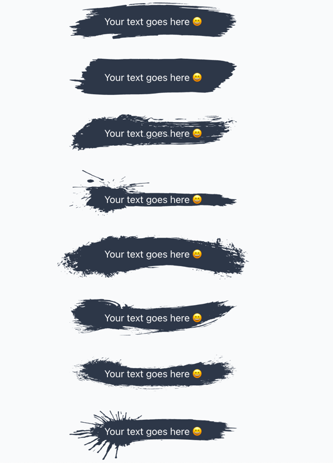

# react-brush-highlighter

> React component for highlighting text. Forked from <a href="https://github.com/aleksandar-b/react-brush-text">https://github.com/aleksandar-b/react-brush-text</a>

[](https://www.npmjs.com/package/react-brush-highlighter) [](https://standardjs.com)

## Install

```bash
npm install --save react-brush-highlighter
```

## Example


#### 8 different types


```jsx
import React, { Component } from 'react'

import { Brush } from 'react-brush-highlighter'

class Example extends Component {
  render() {
    return (<>
        <Brush style={{ padding: '17px 58px' }} type={1}>
          <span style={{ color: 'white' }}>Your text goes here 😄</span>
        </Brush>

        <Brush style={{ padding: '17px 58px' }} type={2}>
          <span style={{ color: 'white' }}>Your text goes here 😄</span>
        </Brush>

        <Brush style={{ padding: '17px 58px' }} type={3}>
          <span style={{ color: 'white' }}>Your text goes here 😄</span>
        </Brush>

        <Brush
          style={{
            padding: '7px 58px',
            paddingBottom: '15px',
            paddingTop: '34px'
          }}
          type={4}
        >
          <span style={{ color: 'white' }}>Your text goes here 😄</span>
        </Brush>

        <Brush style={{ padding: '17px 78px', paddingBottom: '30px'}} type={5}>
          <span style={{ color: 'white' }}>Your text goes here 😄</span>
        </Brush>

        <Brush style={{ padding: '17px 58px' }} type={6}>
          <span style={{ color: 'white' }}>Your text goes here 😄</span>
        </Brush>

        <Brush style={{ padding: '17px 58px' }} type={7}>
          <span style={{ color: 'white' }}>Your text goes here 😄</span>
        </Brush>

        <Brush style={{ padding: '17px 58px', paddingBottom: '35px',
          paddingTop: '20px' }} type={8}>
          <span style={{ color: 'white' }}>Your text goes here 😄</span>
        </Brush>
    </>
  }
}
```

## License

MIT © [tkdailey11](https://github.com/tkdailey11)
